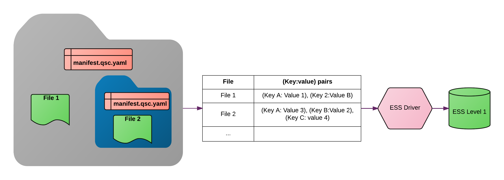
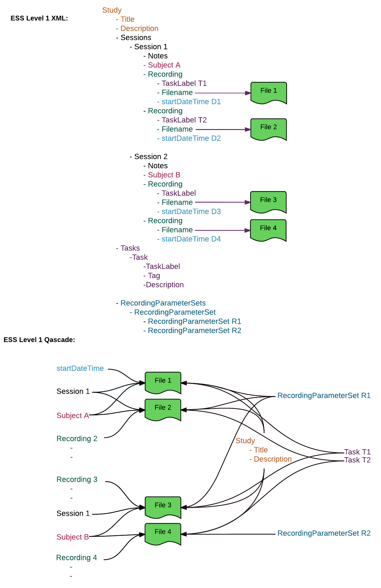

# Qascade: Cascading File Keys

> When you first start off trying to solve a problem, the first solutions you come up with are very complex, and most people stop there. But if you keep going, and live with the problem and peel more layers of the onion off, you can often times arrive at some very elegant and simple solutions. -Steve Jobs

`Qascade` is a user-friendly way to assign meta-data to your data files. Such meta-data can then be used in your data processing scripts, for example to select data files based on a particular key value (e.g. age > 18). Meta-data can also enable data sharing. In developing `Qascade` the emphasis has been put on simplicity, user experience and [The Rule of Least Power](https://en.wikipedia.org/wiki/Rule_of_least_power). Using `Qascade` for meta-data assignment (compared to using `XML` or `JSON`) is similar to using `Markdown` (instead of `HTML`) for writing notes and Readme files. 

**Note:** I started working on `Qascade` at Intheon. I left the company in 2018 and will continue the development in this fork.

The main idea behind the `Qascade` is simple: at each level of a file hierarchy, a special `manifest.qsc.yaml` file (containing `YAML`-formatted text) is placed which contains `(key:value)` pairs that are assigned to all files in the folder and its subfolders. Manifest files in subfolders overwrite keys assigned in parent directories:


Special directives are used to assign `(key:value)` pairs to groups of files, or extract file-specific `(key:value)` pairs, based on file names or paths. Here is an example `Qascade` code:

```
key 1: value 1

(matches *.dat):
   key 1: value 2
   key 2: value 3  

(extract sometitle_S[subjectNumber]_T[taskLabel].h5): direct
```

It first assigns `value 1` to `key 1` of all files in the folder and subfolders. It then, for all `.dat` files, overwrites `key 1` values to `value 3` and assigns `value 3` to `key 2`. Finally, it extracts values for `subjectNumber` and `taskLabel` keys from filenames of files that match `sometitle_S[subjectNumber]_T[taskLabel].h5` pattern.

You can learn from the [Qascade Reference](https://docs.google.com/document/d/1H5wdQ3sHHq7DZsGgmdvrhSesr4AiHoaQgkmPe2yojoM/edit?usp=sharing).

## Example use: EEG/MEG data containerization

`Qascade` may be used as the first step of placing files in [`ESS`](http://www.eegstudy.org)/`BIDS`, etc. An `ESS` driver for `Qascade` is available [in this repository](https://github.com/intheon/qascade/tree/master/matlab/ess-driver). A guide for placing studies in `ESS` containers using `Qascade` is available [here](https://docs.google.com/document/d/1n8s9FsSFD1no9gRmGp1Wtt_8u6YxzfCTHbCfeQAsKYw/edit?usp=sharing).

A `Qascade` parser traverses the folder structure, starting from a root folder, and returns a flat list of files (including their full path), as keys, each associated with an array of `(key: value)` pairs for the file. The output is then be used by `ESS`/`BIDS`/... applications to place the data into domain-specific containers:



Here is a visual comparison between an `ESS Level 1 XML` container and `ESS Level 1 Qascade`:



--------------------------------------------------------------------------------

Until Oct. 2018 Qascade development was supported by The Cognition and Neuroergonomics Collaborative Technology Alliance [(CaN CTA)](http://cancta.net) program of U.S Army Research Labaratory.
